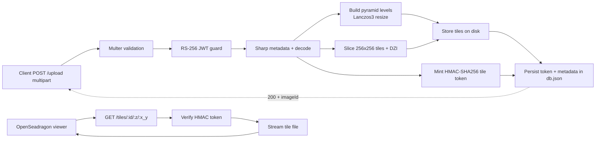

# Secure Image Upload and Tile Delivery Implementation Plan

## Goal

Implement a secure upload-to-view pipeline for zoomable school photo galleries. The system must accept authenticated image uploads, generate Deep Zoom tiles, persist metadata locally, and deliver only signed tile requests to the browser viewer.

## End-to-End Flow



## Five Implementation Phases

### 1. Ingestion

**Objective:** receive image uploads safely and reject invalid input early.

**Implementation steps:**

- Add an Express route for `POST /upload`.
- Use Multer with in-memory or temp-file storage for MVP.
- Enforce file-size limits and accepted MIME types such as JPEG and PNG.
- Return clear `400` errors for invalid files before processing starts.

**Deliverables:**

- Upload middleware
- Input validation rules
- Error responses for oversize or unsupported uploads

### 2. Auth

**Objective:** ensure only authorized users can upload or request tiles.

**Implementation steps:**

- Add a bearer-token middleware that verifies RS-256 JWTs.
- Extract subject and role claims for auditing and ownership.
- Short-circuit invalid or expired tokens with `401 Unauthorized`.
- Place this check before any image decoding or filesystem writes.

**Deliverables:**

- JWT verification middleware
- Claim extraction helper
- Consistent auth failure responses

### 3. Processing

**Objective:** transform a source image into Deep Zoom output ready for OpenSeadragon.

**Implementation steps:**

- Use Sharp to decode the image and read metadata.
- Normalize orientation from EXIF metadata.
- Generate pyramid levels using a Lanczos3 kernel.
- Slice each level into `256 x 256` tiles and emit the `.dzi` manifest.
- In parallel, mint an HMAC-SHA256 tile token with a short TTL tied to the image ID and user context.

**Deliverables:**

- Image pipeline service
- DZI manifest generation
- Tile token signer

### 4. Storage

**Objective:** persist artifacts in a simple MVP-friendly layout.

**Implementation steps:**

- Save tiles to `data/tiles/{id}/{level}/{col}_{row}.jpg`.
- Store image metadata, token metadata, owner claims, dimensions, and timestamps in `data/db.json`.
- Use atomic write patterns for the JSON database to reduce corruption risk.
- Generate opaque image IDs rather than sequential identifiers.

**Deliverables:**

- Filesystem storage helper
- JSON repository helper
- Consistent directory layout

### 5. Delivery

**Objective:** serve only authorized tiles to the Deep Zoom viewer.

**Implementation steps:**

- Add `GET /tiles/:id/:z/:x_y` to validate the HMAC token on every request.
- Reject expired or tampered tokens with `403 Forbidden`.
- Stream tile files with correct cache and content headers.
- Configure OpenSeadragon to load the returned `.dzi` and request visible tiles on demand.

**Deliverables:**

- Secure tile route
- Token verification middleware
- Viewer integration for pan and zoom

## Response Contract

After processing completes successfully, the upload endpoint should return:

```json
{
  "status": "ok",
  "imageId": "opaque-image-id",
  "dziUrl": "/tiles/opaque-image-id/image.dzi",
  "expiresIn": 900
}
```

## Suggested Module Breakdown

- `server/routes/upload.js` — upload endpoint wiring
- `server/middleware/upload.js` — Multer limits and MIME validation
- `server/middleware/auth.js` — RS-256 JWT guard
- `server/services/imagePipeline.js` — Sharp processing and tile generation
- `server/services/tileToken.js` — HMAC signing and verification
- `server/services/storage.js` — local filesystem and db.json writes
- `server/routes/tiles.js` — secure tile delivery route

## Milestone Plan

### Milestone 1: Secure Upload Foundation

- Route setup
- Multer validation
- JWT middleware
- Basic error handling

### Milestone 2: Deep Zoom Processing

- Sharp metadata extraction
- Pyramid generation
- Tile slicing
- `.dzi` manifest output

### Milestone 3: Secure Delivery

- HMAC token issue and validation
- Signed tile endpoint
- OpenSeadragon integration

### Milestone 4: Hardening and Validation

- Path traversal protection
- Token expiry tests
- Upload-to-view end-to-end verification
- Logging and operational cleanup

## Acceptance Criteria

- Unauthorized upload requests are rejected before image processing starts.
- Valid uploads produce a stable image ID, DZI manifest, and tile directory.
- Only signed, unexpired tile requests succeed.
- OpenSeadragon loads tiles progressively while panning and zooming.
- Original full-resolution images are not exposed through a public endpoint.

## Current MVP Status

This flow is now implemented in the local Node and Express app.

### Run Locally

- Start the server with `npm start`
- Open the browser at `/`
- Run verification with `npm test`

### Delivered Endpoints

- `POST /upload` for authenticated multipart image uploads
- `GET /tiles/:id/image.dzi` for the Deep Zoom manifest
- `GET /tiles/:id/:z/:x_y` for signed tile delivery
